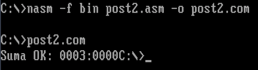
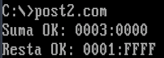
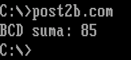
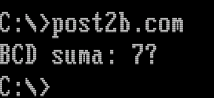
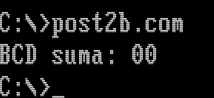
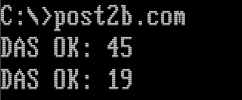
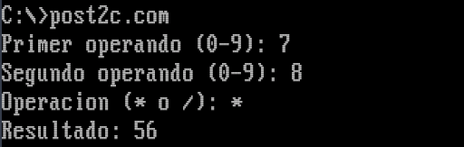
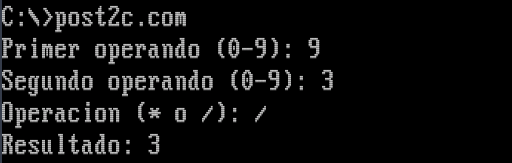
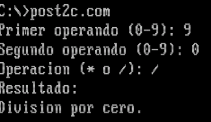

# Unidad 8 - Post-Contenido 2: Operaciones con Cadenas y Aritmética

**Arquitectura de Computadores**  
Ingenieria de Sistemas - Universidad Francisco de Paula Santander  
2026

---

## Descripcion

Este laboratorio implementa en NASM bajo DOSBox operaciones aritméticas de precision multiple de 32 bits usando `ADC` y `SBB`, sumas y restas BCD empaquetadas con `DAA` y `DAS`, y una mini calculadora de enteros que usa `MUL` y `DIV` con conversion ASCII/binaria. Los resultados se verifican mediante los checkpoints propuestos ejecutando los programas en DOSBox.

---

## Requisitos

- DOSBox 0.74 o superior con NASM disponible.
- Haber completado Post-Contenido 1 (instrucciones de cadena).
- Conocimientos previos: flags CF y OF, complemento a 2, BCD empaquetado, INT 21h.

---

## Estructura del repositorio

```
ardila-post2-u8/
├── post2.asm        # Checkpoints 1 y 2: ADC y SBB de 32 bits
├── post2b.asm       # Checkpoints 3 y 4: DAA y DAS (BCD empaquetado)
├── post2c.asm       # Checkpoint 5: calculadora MUL/DIV
├── capturas/        # Capturas de pantalla de la ejecucion en DOSBox
└── README.md
```

---

## Compilacion y ejecucion

Dentro de DOSBox, con NASM disponible en el PATH:

```
nasm -f bin post2.asm -o post2.com
post2.com
```

Repetir sustituyendo `post2` por `post2b` o `post2c` segun corresponda.

---

## Programas y checkpoints

### Checkpoint 1 - post2.com: Suma de 32 bits con ADC

En modo real de 16 bits los numeros de 32 bits se almacenan en pares de registros (DX:AX). La suma se realiza en dos pasos: `ADD` para las partes bajas y `ADC` para las partes altas, propagando el acarreo CF automaticamente.

Se suman A = `0x0001FFFF` y B = `0x00010001`. La instruccion `ADD ax, bx` suma las partes bajas (FFFFh + 0001h = 0000h, CF=1) y `ADC dx, cx` suma las partes altas mas el CF propagado (0001h + 0001h + 1 = 0003h), dando el resultado correcto DX:AX = `0003:0000h`.



---

### Checkpoint 2 - post2.com: Resta de 32 bits con SBB

Extiende el programa anterior con la resta A - B usando `SBB`. Se resta `0x00010001` de `0x00030000`. La instruccion `SUB ax, bx` resta las partes bajas (0000h - 0001h = FFFFh, CF=1 por prestamo) y `SBB dx, cx` resta las partes altas mas el bit de prestamo (0003h - 0001h - 1 = 0001h), dando DX:AX = `0001:FFFFh`.



---

### Checkpoint 3 - post2b.com: Suma BCD empaquetada con DAA

`DAA` corrige AL tras `ADD` para mantener el resultado en formato BCD empaquetado valido (dos digitos decimales por byte). Se verifican tres casos:

- `47h + 38h` con DAA: la suma binaria da `7Fh` (invalido); DAA ajusta a `85h` (BCD correcto para "85").
- `47h + 38h` sin DAA: el resultado queda en `7Fh`, demostrando que sin ajuste el valor no es BCD valido.
- `99h + 01h` con DAA: resultado `00h` con CF=1, indicando acarreo al siguiente byte BCD (el resultado real es "100").





---

### Checkpoint 4 - post2b.com: Resta BCD empaquetada con DAS

`DAS` corrige AL tras `SUB` de la misma forma que `DAA` lo hace para la suma. Se verifican dos casos:

- `73h - 28h`: la resta binaria da `4Bh` (invalido); DAS ajusta a `45h` (BCD correcto para "45").
- `20h - 01h`: la resta binaria da `1Fh` (nibble bajo `Fh` > 9, invalido); DAS ajusta a `19h` (BCD correcto para "19").



---

### Checkpoint 5 - post2c.com: Mini calculadora con MUL y DIV

Lee dos digitos (0-9) desde el teclado con INT 21h/AH=01h, los convierte de ASCII a binario restando 30h, y realiza la operacion seleccionada. `MUL cl` produce el resultado en AX (sin signo). `DIV cl` deja el cociente en AL y el resto en AH; si el divisor es 0 se muestra "Division por cero." La subrutina `imprimirAX` convierte el resultado binario a decimal ASCII usando divisiones sucesivas entre 10, apilando los digitos y sacandolos en orden inverso.

- `7 * 8 = 56`
- `9 / 3 = 3`
- `9 / 0` → Division por cero.





---

## Resumen de instrucciones aritmeticas utilizadas

| Instruccion | Proposito | Condicion clave |
|-------------|-----------|-----------------|
| ADC dst, src | Suma con acarreo: dst = dst + src + CF | CF propagado desde ADD anterior |
| SBB dst, src | Resta con prestamo: dst = dst - src - CF | CF propagado desde SUB anterior |
| DAA | Ajuste decimal tras ADD en AL | Corrige nibbles > 9 sumando 6 |
| DAS | Ajuste decimal tras SUB en AL | Corrige nibbles > 9 restando 6 |
| MUL src | AX = AL * src (sin signo, 8 bits) | Resultado siempre en AX |
| DIV src | AL = AX / src, AH = resto (sin signo) | Genera excepcion si src = 0 |

---

## Autor

Diego Ardila  
Ingenieria de Sistemas - UFPS  
2026